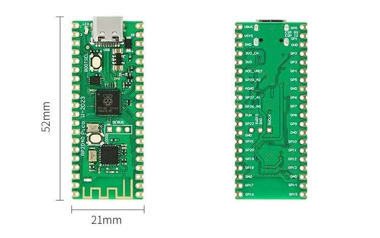
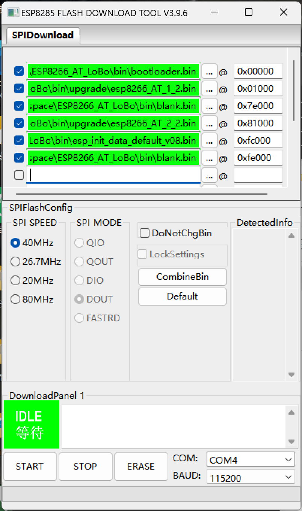

- [带ESP8285无线模块的RP2040芯片开发板使用指南](#带esp8285无线模块的rp2040芯片开发板使用指南)
  - [1. 前情提要](#1-前情提要)
    - [1.1 为什么不再买一块Raspberry Pico W？](#11-为什么不再买一块raspberry-pico-w)
  - [1.2 Arduino无需配置即可使用，为何需要这个指南？](#12-arduino无需配置即可使用为何需要这个指南)
  - [2. 让RP-ESP跟上时代](#2-让rp-esp跟上时代)
    - [2.1 前期准备](#21-前期准备)
      - [2.1.1 固件版本选择](#211-固件版本选择)
      - [2.1.2 刷写工具准备](#212-刷写工具准备)
      - [2.1.3 固件各部分内容介绍](#213-固件各部分内容介绍)
    - [2.2 开始刷写固件](#22-开始刷写固件)
    - [2.3 配合Arduino IDE使用RP-ESP](#23-配合arduino-ide使用rp-esp)
  - [3. 个人作品](#3-个人作品)
  - [4. 致谢](#4-致谢)
  - [5. 欢迎向我提问！](#5-欢迎向我提问)

# 带ESP8285无线模块的RP2040芯片开发板使用指南

**[ [English](./README.md) ] | [ 中文 ]**
## 1. 前情提要
我原本使用的是一块树莓派基金会原产的Raspberry Pico W，但是有一天我突然发现它不能正常工作了，无法连接我的无线网络。经过仔细检查，我发现板子上梯形天线的一个小电容脱落了，经过一番努力，我放弃了这块板子😭。
我在淘宝上能找到的同款板子基本都是50+人民币，对我的开发用途来说有点太贵了，不划算，然后购入了一块标榜着Raspberry Pico W的开发版，商品页我喜欢的Type-C接口以及不太容易损坏的板载天线设计以及20+人民币的价格属实让我心动了。
但我买回来之后发现这只是一块模仿Raspberry Pico板子一比一复刻，并将ESP-01无线模块搬上板子的纯纯中国产产品，所有我以前根据Raspberry Pico W开发板写的代码都不能用了，因为大多数依赖网络链接的第三方库都是根据CYW43439无线模组设计的，所以我的代码不得不全！部！修！改！
幸运的是，我成功了，但是非常折腾，这也是为何我想为与我有相似经历的朋友们提供这个指南，减少不必要的时间开销。
### 1.1 为什么不再买一块Raspberry Pico W？
首先，这块国产板子非常便宜，其次，它以不到正版一半的价格满足了我项目的全部开发需求，而且同样稳定。
以下是这两块板子的一些情况对比（RP2040 with ESP8285开发板简称 RP-ESP， Raspberry Pico W简称Pico W，下同）：
|  差异   | 说明  | 备注 |
|  :----:  | :----:  |  :----:  |
| 与无线模块的通信方式  | Pico W以SPI的方式通信，而RP-ESP以UART0（GP0、GP1）与无线模块通信 | RP-ESP的无线速率较Pico W会更低一些，因为ESP8286在高速波特率通信速率下会不稳定，但不影响基本使用 |
| 无线模块的能力  | CYW43是一块全方位领先ESP8286的芯片（除了价格），比如支持更多的无线接入点数量、更多的协议、更完善的UDP支持、更加省电等等 | RP-ESP适合那些不需要将它作为无线接入点，对网络要求没有那么高的用户 |
| 与无线模块的连接方式  | 与无线模块通信不可避免的会占用一些RP2040的引脚，在这个方面RP-ESP更有优势，因为它占用的引脚比Pico W更少，仅为UART0的TX、RX两个引脚（GP0，GP1）。 | 在Pico W上，板载LED（`LED_BUILTIN`）的控制交给了CYW43，所以只能输出数字信号；而RP-ESP的控制与Pico如出一辙，都可以对`LED_BUILTIN`引脚输出数字和模拟信号，这就意味着我们可以让板载LED闪烁或者渐变。 |
| 无线模块的可定制程度  | Pico W只允许以驱动提供的方式控制无线模块，而RP-ESP可以直接对ESP8285刷入任意普通ESP8285开发板支持的固件。 | 需要注意的是，RP-ESP仅支持为1MB存储的ESP8285（即我们常见的ESP-01模组）开发的固件，当然也可以支持Arduino。 |
## 1.2 Arduino无需配置即可使用，为何需要这个指南？
RP-ESP这块板的ESP8285自带的是AT固件，AT指令集的版本是是停留在2016年推出的1.2版本，这是近10年前推出的系统，很多新的AT指令集都不支持，已经严重过时了。
更重要的是，这个旧版的AT固件只支持已经6年未更新过的[WiFiEsp](https://github.com/bportaluri/WiFiEsp)库，现今这个库已经出现了很多问题，不再适合使用了，和Pico W自带的无线网络库没有可比性。
## 2. 让RP-ESP跟上时代
我们需要做一些工作，来让RP-ESP的ESP8285能够满足我们的基本需求，至少达到Pico-W 80%的可用性，这对我来说已经足够了。
### 2.1 前期准备
使用AT指令的ESP-01（即搭载ESP8285核心的模块）无线模块在Arduino中并非没有支持，我十分推荐@[JAndrassy](https://github.com/JAndrassy)的[WiFiEspAT](https://github.com/JAndrassy/WiFiEspAT)库，但要使用这个库至少需要AT固件的版本大于1.7。
因此，我们需要升级ESP8285的AT固件。
#### 2.1.1 固件版本选择
ESP8285/ESP8266目前经测试唯一可以使用且不会出现任何问题的版本号是1.7.4，因此我们的对比都从这个版本出发。
|  版本   | 差异  | 下载方式 |
|  :----:  | :----:  |  :----:  |
| 官方推出的AT v1.7.4固件  | \ | 官网已经去除了肉眼可见的下载按钮，但还是可以通过[GitHub](https://github.com/espressif/ESP8266_NONOS_SDK/releases)的链接下载，AT 1.7.4固件被包含在是3.0.4版本的包中。 |
| @[loboris](https://github.com/loboris)的ESP8266_AT_LoBo（强烈推荐，本文也基于它说明） | 基于官方3.1.0的版本修改而来，对SSL、OTA等功能的支持更好，还增加了更多的AT指令。 | 详细的改进和下载都可以通过这个[链接](https://github.com/loboris/ESP8266_AT_LoBo)找到。 |
| @[JiriBilek](https://github.com/JiriBilek)的ESP_ATMod  | 较官方版本增加了对TLS 1.2的支持，但同时也去除了对UDP的支持。 | 详细的差异和下载可以通过这个[链接](https://github.com/JiriBilek/ESP_ATMod)查到 |
#### 2.1.2 刷写工具准备
我们有两种工具可以选择，均为官方出品。
+ 官方推出的全平台（支持Windows、Linux、macOS）命令行刷写工具[esptool](https://github.com/espressif/esptool)。
+ 官方推出的图形化[应用程序](https://docs.espressif.com/projects/esp-test-tools/en/latest/esp32/production_stage/tools/flash_download_tool.html)（仅支持Windows），可直接点击[链接](https://www.espressif.com.cn/sites/default/files/tools/flash_download_tool_3.9.6_2.zip)下载。
本着方便小白用户的原则，本文主要以第二种工具来做介绍。
#### 2.1.3 固件各部分内容介绍
以下表格文件名称均以`ESP8266_AT_LoBo\bin`目录下的为例：
|  名称   | 作用  | 刷写地址 |
|  :----:  | :----:  |  :----:  |
| `bootloader.bin`  | 引导系统启动 | `0x00000` |
| `upgrade\esp8266_AT_1_2.bin`  | 系统第一部分 | `0x01000` |
| `blank.bin`  | 空 | `0x7e000` |
| `upgrade\esp8266_AT_2_2.bin`  | 系统第二部分 | `0x81000` |
| `esp_init_data_default_v08.bin`  | 系统初始数据 | `0xfc000` |
| `blank.bin`  | 空 | `0xfe000` |
### 2.2 开始刷写固件
+ 第一步：打开软件，在弹出的窗口选择`esp8285`，然后点击`OK`:

+ 第二步：下载本仓库的`Serial_port_transmission.uf2`，断开RP-ESP板电源，长按下图红色框中的`BOOTSEL`按钮，再插上线连接至电脑，将下载好的`Serial_port_transmission.uf2`拖入新出现的磁盘中（一般叫做`RPI-RP2`），此时磁盘会自动断开，新的名为`TinyUSB`的串口设备将会出现在电脑中。
此时再次断开设备与电脑的连接和供电，按住下图黄色框中的`BOOT`按钮，再次连接电脑，此时的ESP8285将会进入可刷入状态，此时可以通过软件刷写固件，甚至是Arduino的sketch（因为其底层也是使用`esptool`）。

+ 第三步：按照下图所示信息配置好软件，特别是选好右下角`COM:`中你RP-ESP板子对应的串口：:

如果觉得一个个配置固件地址太过麻烦，仓库中还提供了合并包供大家选择，一共有两个版本：`ESP8285_1MB_1.7.4_AT.bin`是官方固件，`ESP8285_1MB_1.7.4_AT_Lobo`是ESP8266_AT_LoBo固件，强烈推荐使用后者刷入。
如果选择使用一体包刷入，请按照下图配置，如果刷入一体包无法正常使用，请选择分开刷入（感谢[@thanhviet228](https://github.com/thanhviet228)反馈）：

+ 第四步：点击`START`按钮，等待刷写结束后，断开RP-ESP板电源后，再次连接电脑，此时任意选择一个串口助手软件，打开RP-ESP对应的串口，输入`AT`指令（以`\r\n`字符做结尾），你可以看到ESP8285返回的`OK`响应，输入`AT+GMR`，将可以看到返回的版本信息中显示系统为1.7.4。
### 2.3 配合Arduino IDE使用RP-ESP
+ 使用Arduino写入RaspberryPi Pico的sketch，我推荐@[earlephilhower](https://github.com/earlephilhower)的[arduino-pico](https://github.com/earlephilhower/arduino-pico)开发套件，不建议使用Arduino官方的`Arduino Mbed OS RP2040 Boards`，因为比起前者，后者要少许多功能和开发样例。
+ 在Arduino IDE中点击`上传`后，下方的输出会卡在`Scanning for RP2040 devices`，此时断开RP-ESP板子和电脑的连接，按住[2.2 开始刷写固件](#22-开始刷写固件)中第二步中红色框选的`BOOTSEL`按钮，再插上线连接至电脑，此时Arduino IDE将会写入sketch至RP-ESP板子看到类似`Wrote xxxxxx bytes to /Volumes/RPI-RP2/NEW.UF2`字样即为成功。
+ 配合`WiFiEspAT`库使用时，务必记得设置`Serial1`的`TX\RX`为`GP0\GP1`，否则可能会出现找不到Wi-Fi模块的错误。与此同时，如果要用到`WiFi.sntp()`相关功能，务必使用ESP8266_AT_LoBo固件。
## 3. 个人作品
将Pico W专用的库替换后，最终的个人作品——一个可调节颜色、亮度的南瓜灯和一个可以显示日期时间、室内环境数据的小摆件，成功复活！一切都和使用Pico W时一样！

## 4. 致谢
+ @[JAndrassy](https://github.com/JAndrassy)的[WiFiEspAT](https://github.com/JAndrassy/WiFiEspAT)
+ @[loboris](https://github.com/loboris)的[ESP8266_AT_LoBo](https://github.com/loboris/ESP8266_AT_LoBo)
+ @[JiriBilek](https://github.com/JiriBilek)的[ESP_ATMod](https://github.com/JiriBilek/ESP_ATMod)
+ @[earlephilhower](https://github.com/earlephilhower)的[arduino-pico](https://github.com/earlephilhower/arduino-pico)
## 5. 欢迎向我提问！
如果有其他疑问，欢迎提出[issue](https://github.com/mentalfl0w/rp2040_with_esp8285_Arduino_guide/issues/new/choose)！