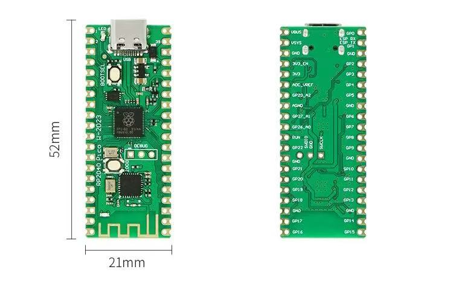
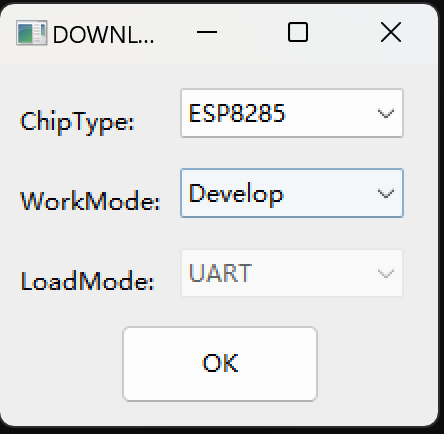
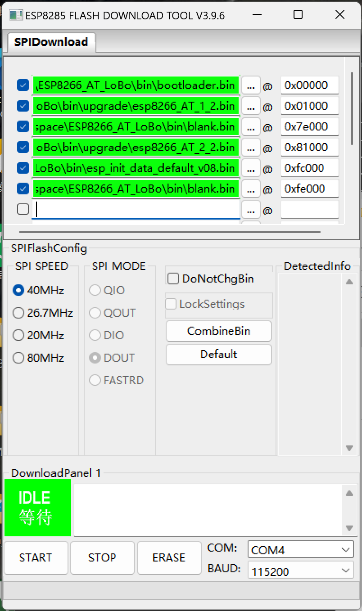
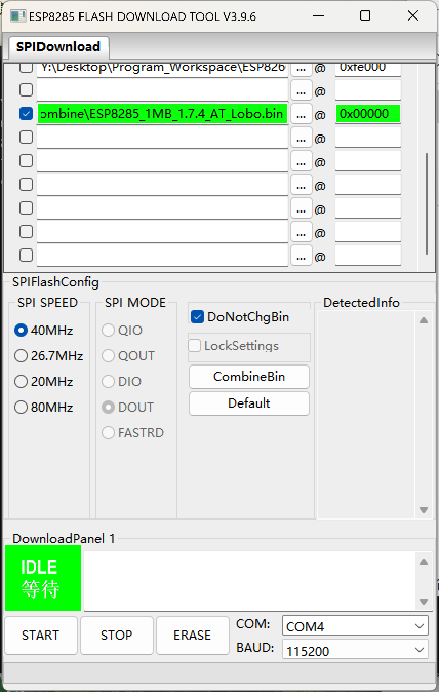
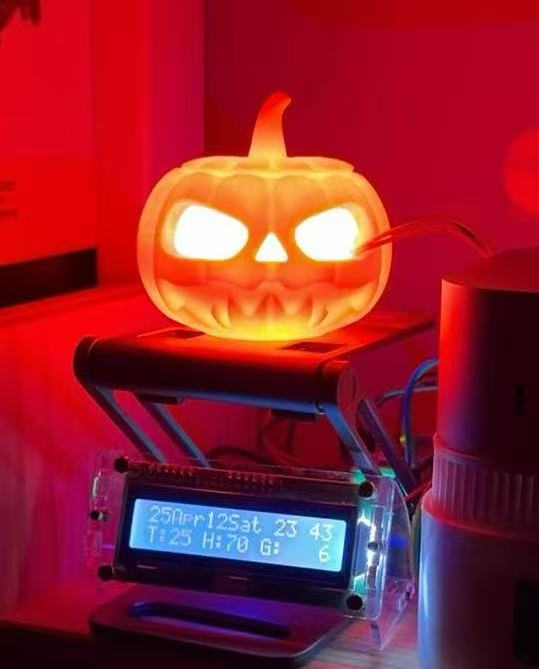

- [RP2040 chip development board with ESP8285 wireless module user guide](#rp2040-chip-development-board-with-esp8285-wireless-module-user-guide)
  - [1. Preliminary Introduction](#1-preliminary-introduction)
    - [1.1 Why not buy another Raspberry Pico W?](#11-why-not-buy-another-raspberry-pico-w)
    - [1.2 Why is this guide necessary if Arduino can be used without setup?](#12-why-is-this-guide-necessary-if-arduino-can-be-used-without-setup)
  - [2. Bringing RP-ESP up to date](#2-bringing-rp-esp-up-to-date)
    - [2.1 Preparation](#21-preparation)
      - [2.1.1 Firmware version selection](#211-firmware-version-selection)
      - [2.1.2 Flashing tools preparation](#212-flashing-tools-preparation)
      - [2.1.3 Firmware components introduction](#213-firmware-components-introduction)
    - [2.2 Starting to flash firmware](#22-starting-to-flash-firmware)
    - [2.3 Using RP-ESP with Arduino IDE](#23-using-rp-esp-with-arduino-ide)
  - [3. Personal projects](#3-personal-projects)
  - [4. Acknowledgments](#4-acknowledgments)
  - [5. Welcome to ask questions!](#5-welcome-to-ask-questions)

# RP2040 chip development board with ESP8285 wireless module user guide

**[ English ] | [ [中文](./README(zh-cn).md) ]**
## 1. Preliminary Introduction
I previously used a Raspberry Pico W produced by the Raspberry Pi Foundation, but one day I noticed it was not working properly and could not connect to my wireless network. After carefully checking, I found that a small capacitor on the board's trapezoidal antenna had fallen off. After some effort, I had to give up on this board 😭.

On Taobao, the original Raspberry Pico W boards I could find were all priced at over 50 RMB, which seemed too expensive for my development purposes. For that reason, I purchased a board labeled as a Raspberry Pico W clone, which featured a Type-C interface and a less easily damaged built-in antenna design, with a price of around 20 RMB. I was attracted by these features.

However, upon receiving it, I found that this was a Chinese-produced clone board that imitated the Raspberry Pico board design one-for-one, simply replacing the ESP-01 wireless module. As a result, all the code I had written for the original Raspberry Pico W no longer worked because most of the third-party libraries relied on the CYW43439 module. Therefore, I had to modify all my code!

Fortunately, I succeeded, but the process was very tedious. This is why I want to provide this guide for friends who have similar experiences, to reduce unnecessary time spent.

### 1.1 Why not buy another Raspberry Pico W?
Firstly, this Chinese board is very cheap. Secondly, it meets all my project requirements at less than half the price of an official Raspberry Pico W, and it is equally stable.

Here's a comparison between the two boards (RP2040 with ESP8285 development board is abbreviated as RP-ESP, and Raspberry Pico W is abbreviated as Pico W, the same below.):

| Difference | Explanation | Notes |
|  :----:  | :----:  |  :----:  |
| Communication with the wireless module | Pico W uses SPI communication, while RP-ESP uses UART0 (GP0、GP1). | The wireless speed of RP-ESP is somewhat lower than Pico W because ESP8286 becomes unstable at high baud rates. However, this doesn't affect basic usage. |
| Wireless module capability | CYW43 is superior to ESP8286 in all aspects except price (e.g., supports more access points, more protocols, better UDP support, more power-efficient). | RP-ESP is suitable for users who do not require it to act as an access point and have lower network demands. |
| Connection method with the wireless module | Communication with the wireless module inevitably occupies some pins of RP2040. In this aspect, RP-ESP has an advantage as it only occupies GP0 and GP1 (UART0's TX, RX). | On Pico W, the built-in LED (`LED_BUILTIN`) control is handed over to CYW43, meaning only digital signals can be output. RP-ESP retains LED control similar to Pico, allowing both digital and analog signal outputs to the `LED_BUILTIN` pin. |
| Customization level of the wireless module | Pico W only allows control of the wireless module via its driver. RP-ESP can flash any firmware supported by standard ESP8285 boards onto the module. | Note: RP-ESP only supports 1MB memory ESP8285 (the common ESP-01 module) firmware, including Arduino support. |

### 1.2 Why is this guide necessary if Arduino can be used without setup?
The ESP8285 on RP-ESP comes with AT firmware, which is based on a 2016-vintage AT instruction set (version 1.2), outdated after nearly a decade with many new commands unsupported.
More importantly, this old AT firmware only supports the outdated [WiFiEsp](https://github.com/bportaluri/WiFiEsp) library, which has many issues and is unsuitable for use, far inferior to Pico W's built-in Wi-Fi library.

## 2. Bringing RP-ESP up to date
We need to make some adjustments to ensure that the ESP8285 on RP-ESP meets our basic needs, at least matching 80% of Pico W's functionality, which is sufficient for my purposes.

### 2.1 Preparation
Using AT command set ESP-01 (with ESP8285 core) is supported by [WiFiEspAT](https://github.com/JAndrassy/WiFiEspAT) library by @[JAndrassy](https://github.com/JAndrassy). But to use this library, the AT firmware must be at least version 1.7.

Therefore, we need to upgrade ESP8285's AT firmware.

#### 2.1.1 Firmware version selection
Based on tested versions, the only usable and trouble-free version is 1.7.4. Our comparisons are based on this version.

| Version | Differences| Download method |
|  :----:  | :----:  |  :----:  |
| Officially released AT v1.7.4 firmware | \ | Download link available on [GitHub](https://github.com/espressif/ESP8266_NONOS_SDK/releases), included in SDK v3.0.4. |
| [loboris](https://github.com/loboris)'s ESP8266_AT_LoBo (strongly recommended, this guide is based on it) | Modified from official v3.1.0 to improve support for SSL, OTA, etc., adding more AT commands. | More details and downloads available on [this link](https://github.com/loboris/ESP8266_AT_LoBo). |
| [JiriBilek](https://github.com/JiriBilek)'s ESP_ATMod | Adds TLS 1.2 support compared to official versions but removes UDP support. | Differences and downloads available through [this link](https://github.com/JiriBilek/ESP_ATMod). |

#### 2.1.2 Flashing tools preparation
We have two options, both official.
+ Official command-line tool [esptool](https://github.com/espressif/esptool) for all platforms (Windows, Linux, macOS).
+ Official graphical application [tool](https://docs.espressif.com/projects/esp-test-tools/en/latest/esp32/production_stage/tools/flash_download_tool.html) (only for Windows). Direct download [link](https://www.espressif.com.cn/sites/default/files/tools/flash_download_tool_3.9.6_2.zip).

For the convenience of newbie users, this guide mainly introduces the second tool.

#### 2.1.3 Firmware components introduction
Below table lists file names and their purposes from `ESP8266_AT_LoBo\bin` directory:
| Name | Function | Flash address |
|  :----:  | :----:  |  :----:  |
| `bootloader.bin` | Boots the system | `0x00000` |
| `upgrade\esp8266_AT_1_2.bin` | System first part | `0x01000` |
| `blank.bin` | Empty | `0x7e000`|
| `upgrade\esp8266_AT_2_2.bin` | System second part | `0x81000` |
| `esp_init_data_default_v08.bin` | Initial system data| `0xfc000` |
| `blank.bin` | Empty | `0xfe000` |

### 2.2 Starting to flash firmware
+ Step 1: Open the software, select `esp8285` in the pop-up window and click `OK`.
+ Step 2: Download `Serial_port_transmission.uf2` from this repository, disconnect power from RP-ESP board, press `BOOTSEL` button as shown in the red box in the image, then connect to computer. Drag the downloaded `Serial_port_transmission.uf2` into the new drive (usually named `RPI-RP2`). The disk will automatically disconnect, and a new serial device named `TinyUSB` will appear on the computer. Disconnect the RP-ESP from the computer and power source, press `BOOT` button in the yellow box again, reconnect to computer. The ESP8285 will now be in flashable state.

+ Step 3: Configure the software as shown in the image, especially selecting the correct serial port for your RP-ESP.
If manually configuring firmware addresses is too much of a hassle, the repository provides combined packages. There are two versions: `ESP8285_1MB_1.7.4_AT.bin` (official) and `ESP8285_1MB_1.7.4_AT_Lobo` (Lobo firmware). The latter is strongly recommended.

If choosing the integrated package, configure as follows. If flashing the integrated package doesn't work, please choose to flash it separately (thanks to [@thanhviet228](https://github.com/thanhviet228) for the feedback):
+ Step 4: Click `START` button, wait for flashing to complete. Disconnect power from RP-ESP, reconnect and open a serial monitor with the correct COM port. Enter `AT` command (ending with `\r\n`), expect `OK`. Input `AT+GMR`, verify system version 1.7.4 in response.

### 2.3 Using RP-ESP with Arduino IDE
+ I recommend [@earlephilhower](https://github.com/earlephilhower)'s [arduino-pico](https://github.com/earlephilhower/arduino-pico) package for writing sketches to RaspberryPi Pico, instead of Arduino's `Arduino Mbed OS RP2040 Boards` due to fewer features and examples.
+ When uploading via Arduino IDE, it may get stuck at `Scanning for RP2040 devices`. Disconnect the RP-ESP, press and hold the red boxed `BOOTSEL` button in step 2 of [2.2 Starting to flash firmware](#22-starting-to-flash-firmware), reconnect and attempt upload. Success is indicated by messages like `Wrote xxxxxx bytes to /Volumes/RPI-RP2/NEW.UF2`.
+ When using `WiFiEspAT` library, ensure `Serial1`'s `TX/RX` are set to `GP0/GP1`. Also, for `WiFi.sntp()` functions, must use Lobo firmware.

## 3. Personal projects
After adapting the Pico W libraries, my personal projects—a color/brightness adjustable pumpkin lamp and a display for indoor environment data—revived successfully, functioning as smoothly as with Pico W.

## 4. Acknowledgments
+ [@JAndrassy](https://github.com/JAndrassy) for [WiFiEspAT](https://github.com/JAndrassy/WiFiEspAT)
+ [@loboris](https://github.com/loboris) for [ESP8266_AT_LoBo](https://github.com/loboris/ESP8266_AT_LoBo)
+ [@JiriBilek](https://github.com/JiriBilek) for [ESP_ATMod](https://github.com/JiriBilek/ESP_ATMod)
+ [@earlephilhower](https://github.com/earlephilhower) for [arduino-pico](https://github.com/earlephilhower/arduino-pico)

## 5. Welcome to ask questions!
If you have any other questions, feel free to raise an issue [here](https://github.com/mentalfl0w/rp2040_with_esp8285_Arduino_guide/issues/new/choose)!